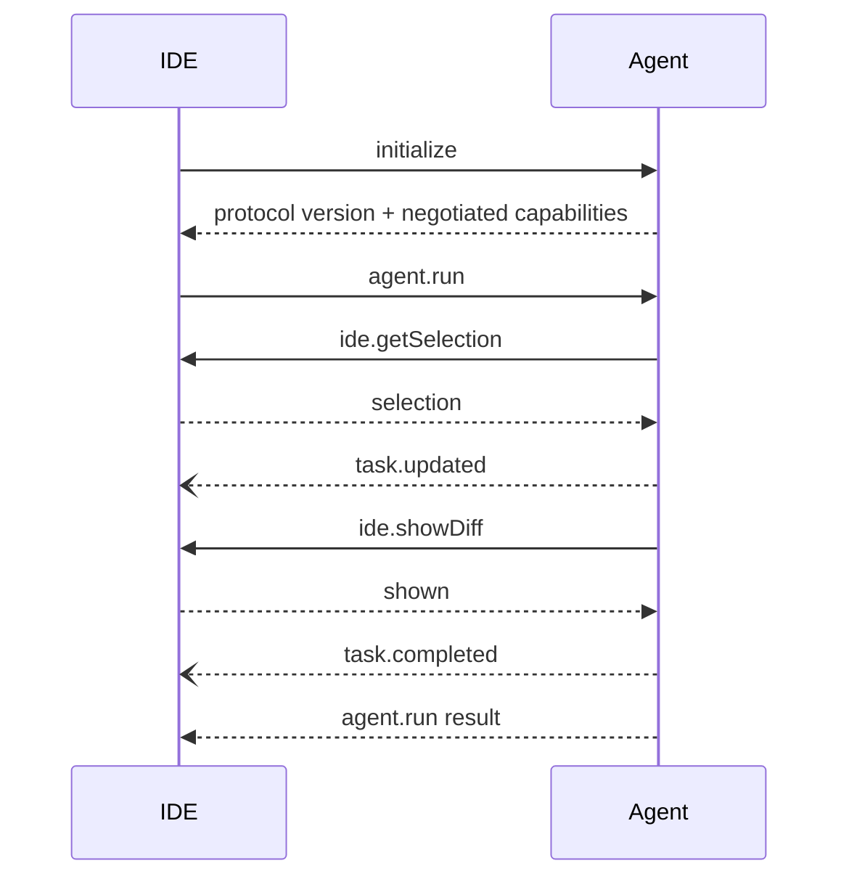

# Plivor Agent Protocol

Official communication boundary between Plivor IDE and Plivor Agent. The protocol is bidirectional JSON-RPC 2.0 style messaging over an abstract message channel. Neither side imports the other's internal classes.

Protocol version: `1.0`.

## Included

- Canonical JSON Schema for every RPC request, response, and event.
- TypeScript SDK for validation, request correlation, event handling, capability checks, and version negotiation.
- Python SDK with the same behavior and schemas.
- Public negotiated-capability discovery through `ProtocolPeer.negotiatedCapabilities` in TypeScript and `ProtocolPeer.negotiated_capabilities` in Python.
- Node local transport for Unix Domain Sockets and Windows Named Pipes.
- Python client transport for Unix Domain Sockets and Windows Named Pipes.
- Cross-language milestone test: TypeScript IDE peer ↔ Python Agent peer.

Concrete transport code is separate from `ProtocolPeer`. WebSocket and TCP adapters can be added without changing protocol DTOs.

## Install

```bash
npm install
pyr install
```

`npm` manages the TypeScript SDK toolchain. `pyr` manages the Python SDK environment. `.pyr/` and `pyr.lock` remain local because the current lock format selects platform-specific wheels while this repository supports Windows, Linux, and macOS.

## Message flow



Every event carries `taskId`, `eventId`, `sequence`, and `timestamp`. Both SDKs reject sequence gaps before sending and after receiving.

## TypeScript

```ts
import { ProtocolPeer } from "@plivor-labs/agent-protocol";
import { listenSocket, windowsNamedPipePath } from "@plivor-labs/agent-protocol/node";

const endpoint = windowsNamedPipePath("plivor-agent-1234");
const server = await listenSocket(endpoint, async (channel) => {
  const ide = new ProtocolPeer(channel);
  ide.register("ide.getSelection", async () => currentSelection());
  ide.register("ide.showDiff", async (params) => showDiff(params));
  await ide.initialize({
    protocolVersion: "1.0",
    clientName: "plivor-ide",
    clientVersion: "0.1.0",
    capabilities: ["editor.selection", "editor.showDiff"]
  });
});
```

## Python

```python
from plivor_agent_protocol import ProtocolPeer, connect_local_socket

channel = await connect_local_socket(endpoint)
agent = ProtocolPeer(channel)
agent.register_initialize_handler(
    agent_version="0.1.0",
    supported_capabilities=["editor.selection", "editor.showDiff"],
)
agent.register("agent.run", run_task)
await agent.wait_closed()
```

## Contract layout

- `sdk/python/plivor_agent_protocol/schemas/v1/`: canonical schemas and method/event manifest.
- `src/`: TypeScript types, validator, peer, and Node transport adapter.
- `sdk/python/plivor_agent_protocol/`: Python types, validator, peer, and local transport client.
- `fixtures/v1/conformance.json`: examples validated by both SDKs.
- `docs/compatibility.md`: compatibility and capability rules.
- `proposals/`: protocol change process.

## Verify

```bash
# Linux/macOS
pyr run npm run verify

# Windows
pyr run npm.cmd run verify
```

`npm run verify` performs TypeScript type checking, TypeScript tests, Python tests, the real cross-language local-transport flow, and the TypeScript build.

## Release

Package version and wire `protocolVersion` are independent. The first package release is `0.1.0`; wire protocol remains `1.0`.

1. For the first npm release, add a granular publish token as repository secret `NPM_TOKEN`.
2. Configure a pending PyPI Trusted Publisher for project `plivor-agent-protocol`, owner `plivor-labs`, repository `agent-protocol`, and workflow `release.yml`.
3. Push tag `v0.1.0`. The workflow verifies Windows, Linux, and macOS, publishes npm and PyPI packages, then creates the GitHub release.
4. After npm creates `@plivor-labs/agent-protocol`, configure its Trusted Publisher for `plivor-labs/agent-protocol` and `release.yml`, then remove `NPM_TOKEN`.

## Scope

SDKs contain serialization, deserialization, schema validation, request correlation, event handling, version negotiation, and transport framing. Agent execution, editor state, permissions, model providers, and other business logic remain in their owning repositories.
